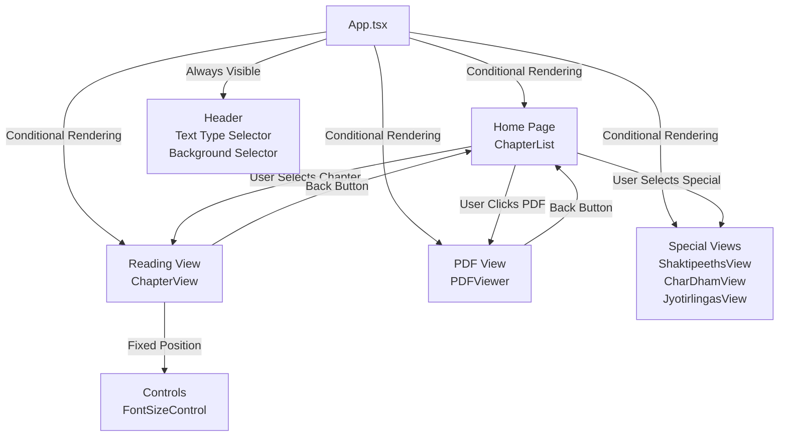
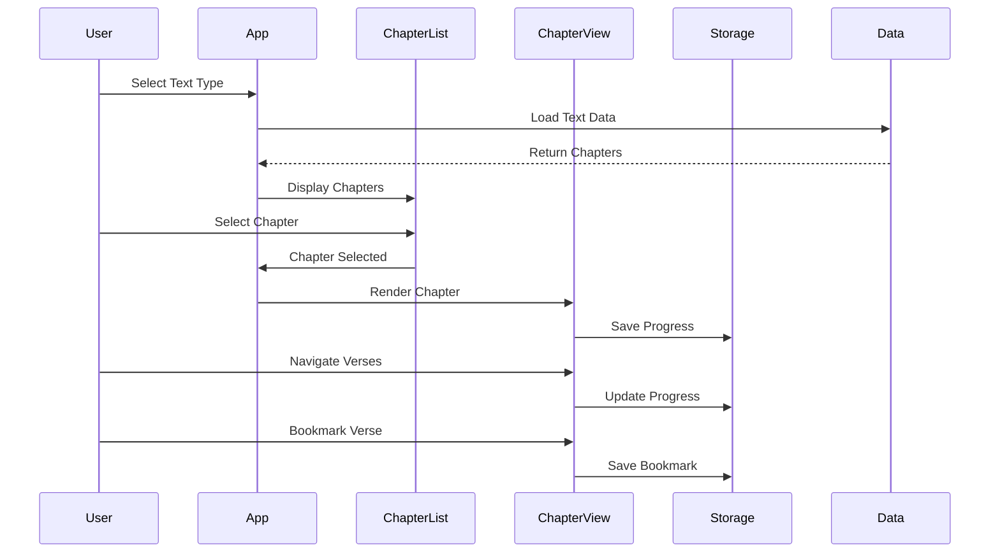
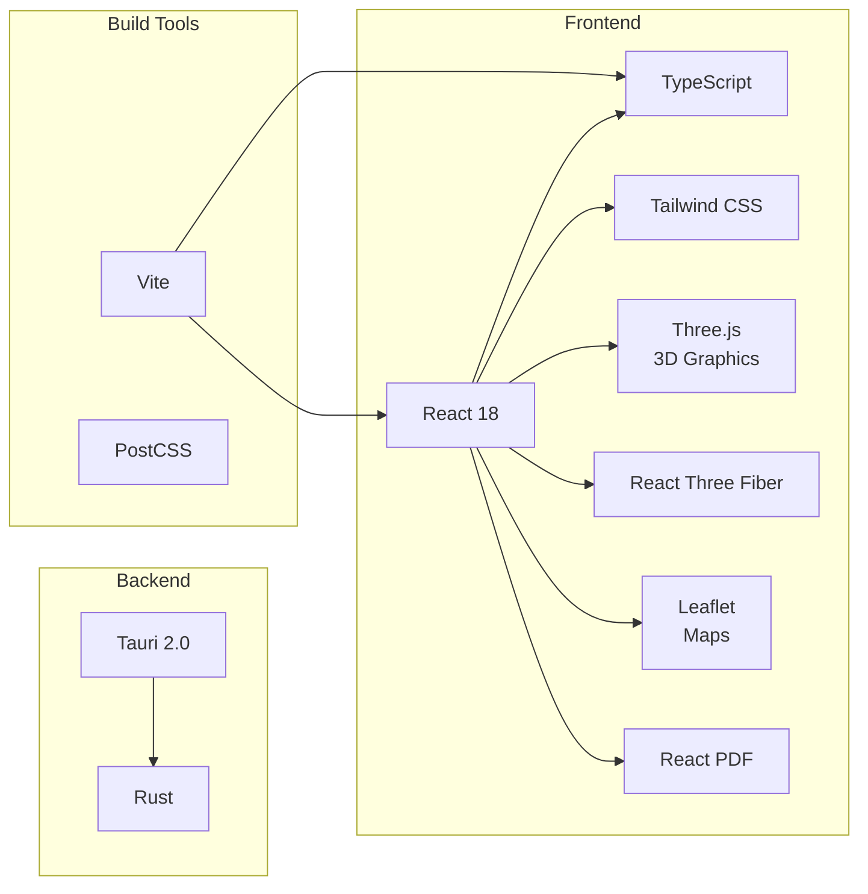

# Dharmic Treasures - Architecture Diagram

```mermaid
graph TB
    %% Entry Point
    Index[index.tsx]
    App[App.tsx<br/>Main Application]
    Index --> App

    %% Data Layer
    Gita[data/gita.ts]
    HanumanChalisa[data/hanumanChalisa.ts]
    Sunderkand[data/sunderkand.ts]
    BajrangBaan[data/bajrangBaan.ts]
    YakshaPrashna[data/yakshaPrashn.ts]
    Shaktipeeths[data/shaktipeeths.ts]
    CharDham[data/charDham.ts]
    Jyotirlingas[data/jyotirlingas.ts]
    PDF[public/sadhak-sanjeevani.pdf]

    %% Core Components
    ChapterList[ChapterList<br/>Chapter Selection]
    ChapterView[ChapterView<br/>Verse Reading]
    PDFViewer[PDFViewer<br/>PDF Display]
    ShaktipeethsView[ShaktipeethsView<br/>Shaktipeeths Map]
    CharDhamView[CharDhamView<br/>Char Dham Info]
    JyotirlingasView[JyotirlingasView<br/>Jyotirlingas Info]
    BackgroundSelector[BackgroundSelector<br/>Theme Control]
    FontSizeControl[FontSizeControl<br/>Font Size]
    ErrorBoundary[ErrorBoundary<br/>Error Handling]

    %% Supporting Components
    SearchBar[SearchBar<br/>Search Functionality]
    GitaChatbot[GitaChatbot<br/>AI Chatbot]
    ChapterCard3D[ChapterCard3D<br/>3D Card Display]
    BookmarkButton[BookmarkButton<br/>Save Bookmarks]
    ShareButton[ShareButton<br/>Share Verses]
    ExportButton[ExportButton<br/>Export Content]
    ProgressIndicator[ProgressIndicator<br/>Reading Progress]
    ShaktipeethsMap[ShaktipeethsMap<br/>Leaflet Map]
    Scene3D[Scene3D<br/>3D Scene]
    Krishna[Krishna<br/>3D Model]
    Arjuna[Arjuna<br/>3D Model]

    %% Icons
    ArrowLeftIcon[ArrowLeftIcon]
    ChevronLeftIcon[ChevronLeftIcon]
    ChevronRightIcon[ChevronRightIcon]

    %% Utilities
    Storage[utils/storage.ts<br/>localStorage Management]
    Transliteration[utils/transliteration.ts<br/>Text Conversion]
    TauriUtils[utils/tauri.ts<br/>Tauri Integration]
    Bookmarks[Bookmarks Management]
    Progress[Reading Progress]
    Settings[App Settings]

    %% Tauri Backend
    MainRs[src-tauri/src/main.rs<br/>Rust Entry Point]
    LibRs[src-tauri/src/lib.rs<br/>Rust Logic]
    TauriConfig[src-tauri/tauri.conf.json<br/>Tauri Configuration]

    %% Configuration
    PackageJson[package.json<br/>Dependencies & Scripts]
    ViteConfig[vite.config.ts<br/>Build Configuration]
    TailwindConfig[tailwind.config.js<br/>Styling Configuration]
    TypeScriptConfig[tsconfig.json<br/>TypeScript Config]
    Types[types.ts<br/>Type Definitions]

    %% Text Types
    TextTypes[TextType Union<br/>gita, hanumanChalisa, sunderkand,<br/>bajrangBaan, yakshaPrashna,<br/>shaktipeeths, charDham, jyotirlingas]

    %% App Connections
    App --> ChapterList
    App --> ChapterView
    App --> PDFViewer
    App --> ShaktipeethsView
    App --> CharDhamView
    App --> JyotirlingasView
    App --> BackgroundSelector
    App --> FontSizeControl
    App --> ErrorBoundary
    App --> TextTypes

    %% Data Flow
    Gita --> App
    HanumanChalisa --> App
    Sunderkand --> App
    BajrangBaan --> App
    YakshaPrashna --> App
    Shaktipeeths --> App
    CharDham --> App
    Jyotirlingas --> App
    PDF --> PDFViewer

    %% Component Dependencies
    ChapterList --> SearchBar
    ChapterList --> GitaChatbot
    ChapterList --> ChapterCard3D
    ChapterView --> BookmarkButton
    ChapterView --> ShareButton
    ChapterView --> ExportButton
    ChapterView --> ProgressIndicator
    ChapterView --> ArrowLeftIcon
    ChapterView --> ChevronLeftIcon
    ChapterView --> ChevronRightIcon
    ShaktipeethsView --> ShaktipeethsMap
    ChapterCard3D --> Scene3D
    Scene3D --> Krishna
    Scene3D --> Arjuna

    %% Storage Connections
    ChapterList --> Storage
    ChapterView --> Storage
    ChapterView --> Transliteration
    BookmarkButton --> Storage
    Storage --> Bookmarks
    Storage --> Progress
    Storage --> Settings

    %% Tauri Connections
    MainRs --> LibRs
    TauriUtils -.-> LibRs

    %% Styling
    App --> TailwindConfig
    ChapterList --> TailwindConfig
    ChapterView --> TailwindConfig

    %% Type Safety
    App --> Types
    ChapterList --> Types
    ChapterView --> Types
    Storage --> Types

    style App fill:#f9a,stroke:#333,stroke-width:4px
    style Index fill:#9af,stroke:#333,stroke-width:2px
    style Storage fill:#9f9,stroke:#333,stroke-width:2px
    style Types fill:#ff9,stroke:#333,stroke-width:2px
    style MainRs fill:#f99,stroke:#333,stroke-width:2px
```

## Component Hierarchy

```mermaid
graph TD
    App[App.tsx] --> |Conditional Rendering| HomePage[Home Page<br/>ChapterList]
    App --> |Conditional Rendering| ReadingView[Reading View<br/>ChapterView]
    App --> |Conditional Rendering| PDFView[PDF View<br/>PDFViewer]
    App --> |Conditional Rendering| SpecialViews[Special Views<br/>ShaktipeethsView<br/>CharDhamView<br/>JyotirlingasView]

    HomePage --> |User Selects Chapter| ReadingView
    HomePage --> |User Clicks PDF| PDFView
    HomePage --> |User Selects Special| SpecialViews
    ReadingView --> |Back Button| HomePage
    PDFView --> |Back Button| HomePage

    App --> |Always Visible| Header[Header<br/>Text Type Selector<br/>Background Selector]
    ReadingView --> |Fixed Position| Controls[Controls<br/>FontSizeControl]
```

## Data Flow

```mermaid
sequenceDiagram
    participant User
    participant App
    participant ChapterList
    participant ChapterView
    participant Storage
    participant Data

    User->>App: Select Text Type
    App->>Data: Load Text Data
    Data-->>App: Return Chapters
    App->>ChapterList: Display Chapters
    User->>ChapterList: Select Chapter
    ChapterList->>App: Chapter Selected
    App->>ChapterView: Render Chapter
    ChapterView->>Storage: Save Progress
    User->>ChapterView: Navigate Verses
    ChapterView->>Storage: Update Progress
    User->>ChapterView: Bookmark Verse
    ChapterView->>Storage: Save Bookmark
```

## Technology Stack

```mermaid
graph LR
    subgraph "Frontend"
        React[React 18]
        TypeScript[TypeScript]
        TailwindCSS[Tailwind CSS]
        ThreeJS[Three.js<br/>3D Graphics]
        ReactThreeFiber[React Three Fiber]
        Leaflet[Leaflet<br/>Maps]
        ReactPDF[React PDF]
    end

    subgraph "Backend"
        Tauri[Tauri 2.0]
        Rust[Rust]
    end

    subgraph "Build Tools"
        Vite[Vite]
        PostCSS[PostCSS]
    end

    React --> TypeScript
    React --> TailwindCSS
    React --> ThreeJS
    React --> ReactThreeFiber
    React --> Leaflet
    React --> ReactPDF
    Tauri --> Rust
    Vite --> React
    Vite --> TypeScript
```

## Features Overview

```mermaid
graph TD
    Root[Dharmic Treasures]
    
    Root --> Texts[Texts]
    Root --> SpecialViews[Special Views]
    Root --> Features[Features]
    Root --> Platforms[Platforms]
    
    Texts --> Gita[Bhagavad Gita]
    Texts --> Chalisa[Hanuman Chalisa]
    Texts --> Sunderkand[Sunderkand]
    Texts --> Bajrang[Bajrang Baan]
    Texts --> Yaksha[Yaksha Prashna]
    
    SpecialViews --> Shaktipeeths[Shaktipeeths Map]
    SpecialViews --> CharDham[Char Dham]
    SpecialViews --> Jyotirlingas[Jyotirlingas]
    
    Features --> Bookmarks[Bookmarks]
    Features --> Progress[Reading Progress]
    Features --> Search[Search]
    Features --> PDF[PDF Viewer]
    Features --> Chatbot[AI Chatbot]
    Features --> Visualizations[3D Visualizations]
    Features --> Share[Share Verses]
    Features --> Export[Export Content]
    Features --> FontSize[Font Size Control]
    Features --> Themes[Background Themes]
    
    Platforms --> Web[Web]
    Platforms --> Desktop[Desktop Tauri]
    Platforms --> Mobile[Mobile Ready]
    
    style Root fill:#f9a,stroke:#333,stroke-width:4px
    style Texts fill:#9af,stroke:#333,stroke-width:2px
    style SpecialViews fill:#9af,stroke:#333,stroke-width:2px
    style Features fill:#9af,stroke:#333,stroke-width:2px
    style Platforms fill:#9af,stroke:#333,stroke-width:2px
```
