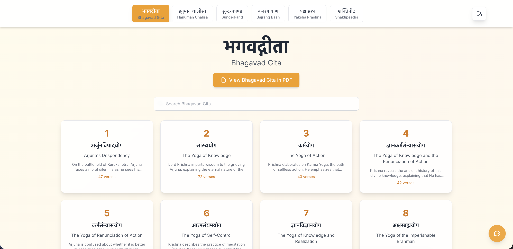
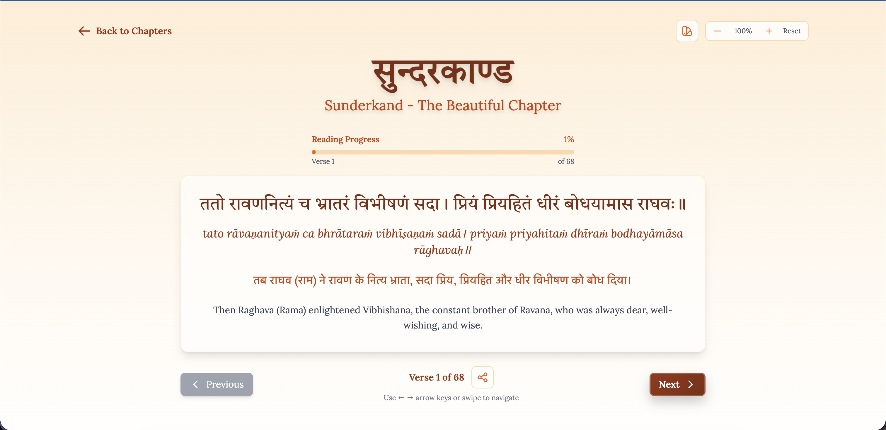
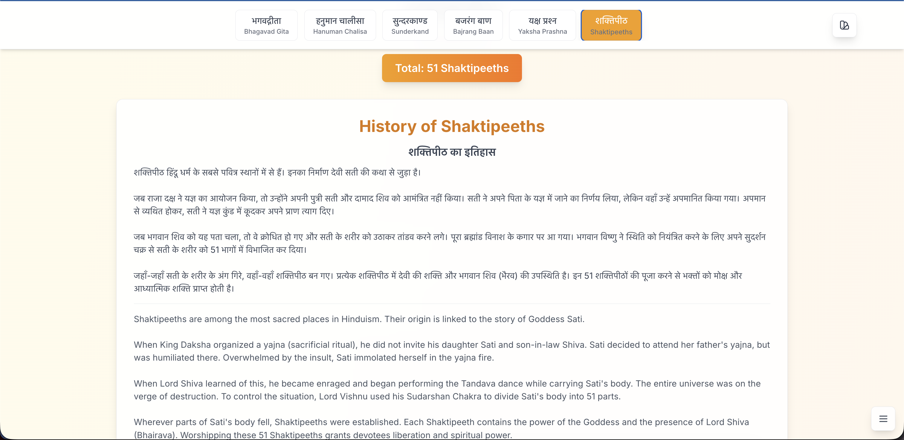
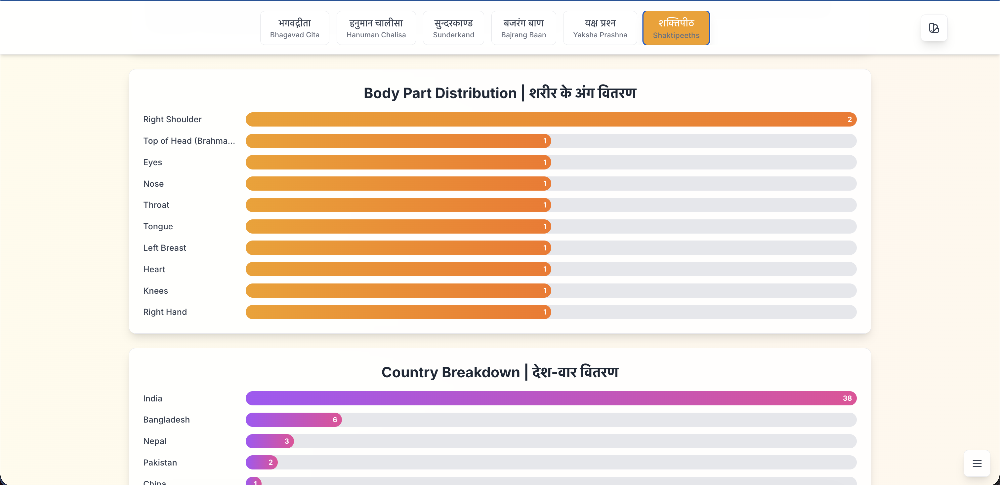
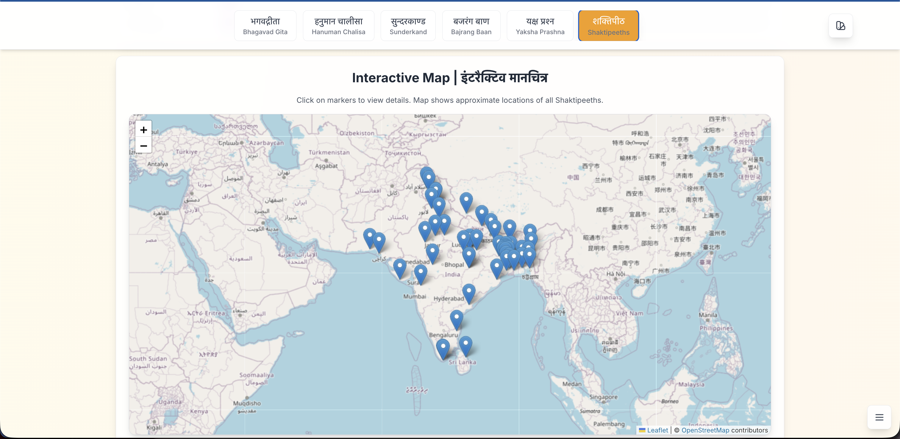

# धर्मिक खजाना | Dharmic Treasures

<div align="center">



**An interactive web application to explore the timeless wisdom of Hindu scriptures**

[🌐 Live Site](https://technoblogger14o3.github.io/dharmic-treasures/) | [📖 Documentation](#-about) | [🚀 Getting Started](#-getting-started)

</div>

---

## 📖 About

This is a modern, interactive web application that brings the sacred texts of Hindu philosophy to life. The application features multiple scriptures including the Bhagavad Gita, Hanuman Chalisa, Sunderkand, Bajrang Baan, Yaksha Prashna, and an extensive guide to the 51 Shaktipeeths, all with a beautiful UI and an intelligent chatbot that helps answer life's questions using the wisdom of the Bhagavad Gita.

## ✨ Features

### 🎯 Core Features

- **📚 Multiple Sacred Texts**: Access six different sacred texts and guides in one application

  - **Bhagavad Gita**: All 18 chapters with 700+ verses, with PDF viewer support
  - **Hanuman Chalisa**: 40 verses of devotion
  - **Sunderkand**: The beautiful chapter from Ramayana
  - **Bajrang Baan**: The powerful prayer to Lord Hanuman
  - **Yaksha Prashna**: 126 questions and answers from Mahabharata
  - **Shaktipeeths**: Complete guide to all 51 sacred Shaktipeeths with interactive map

- **🗺️ Interactive Shaktipeeths Explorer**:
  - Complete database of all 51 Shaktipeeths with detailed information
  - Interactive map visualization with Leaflet
  - Filter by state, country, and body part
  - Quick filter chips for easy navigation
  - Sort by name (A-Z), state, country, and ID
  - Toggle between grid and list views
  - Data visualizations:
    - Body part distribution chart
    - Country breakdown chart
    - State-wise statistics
  - Detailed modal view with historical significance, spiritual importance, and pilgrimage information

- **📄 PDF Viewer**: 
  - Built-in PDF viewer for sacred texts
  - Page-by-page navigation
  - Tap/click navigation on pages
  - Responsive design for all devices
  - Smooth page transitions

- **🤖 Intelligent Gita Chatbot**: Ask life questions and get relevant verses from the Bhagavad Gita

  - Semantic search with keyword expansion
  - Finds most relevant verses based on your question
  - Clickable verse links to read in detail
  - Works completely offline (no external APIs)

- **🔍 Advanced Search**: Search across all chapters and verses

  - Search by keywords, phrases, or concepts
  - Direct navigation to specific verses
  - Real-time search results

- **🎨 Customizable Themes**:

  - Multiple background gradient options (5 themes)
  - Background selector in top-right corner
  - Adjustable font sizes for comfortable reading
  - Smooth theme transitions

- **📱 Fully Responsive**: Works seamlessly on desktop, tablet, and mobile devices

- **🌐 Multilingual Support**:

  - Original Sanskrit text
  - Hindi translations
  - English transliteration and meanings

- **📊 Progress Tracking**: Visual progress indicator showing reading progress with automatic save/restore

- **🔗 Share Functionality**: Share specific verses with others

- **⭐ Bookmarks**: Save favorite verses for quick access later

- **💾 Export & Print**: Export verses as text files or print them with beautiful formatting

- **💻 Native Desktop App**: Build native desktop apps for Windows, macOS, and Linux using Tauri

- **📱 Native Mobile Apps**: Build native iOS and Android apps using Tauri (coming soon)

---

## 📸 Screenshots

### Home Page


*Beautiful home page with text type selector and customizable background themes*

### Bhagavad Gita


*Browse through all 18 chapters of the Bhagavad Gita*

### Hanuman Chalisa


*Read the 40 verses of Hanuman Chalisa*

### Sunderkand


*Explore the beautiful chapter from Ramayana*

### Bajrang Baan


*The powerful prayer to Lord Hanuman*

### Yaksha Prashna


*126 questions and answers from Mahabharata*

### Yaksha Prashna Content


*Detailed view with Hindi translations of questions and answers*

### Shaktipeeths - History


*Introduction to the history and significance of Shaktipeeths*

### Shaktipeeths - Contents


*Browse all 51 Shaktipeeths with filtering and sorting options*

### Shaktipeeths - Interactive Map


*Interactive map showing locations of all Shaktipeeths*

### Shaktipeeths - Additional Views


*Shaktipeeths with filters and visualizations*


*Grid view of Shaktipeeths*


*List view with detailed information*


*Modal view with complete details*

---

## 🛠️ Tech Stack

### Frontend Framework

- **React 18.3.1** - Modern UI framework with hooks and functional components
- **TypeScript 5.5.3** - Type-safe development for better code quality
- **Vite 5.3.1** - Lightning-fast build tool and dev server with HMR
- **Tailwind CSS 3.4.3** - Utility-first CSS framework for rapid UI development

### Core Libraries

- **react-pdf 10.2.0** - PDF viewing and rendering in React
- **pdfjs-dist 5.4.394** - Mozilla's PDF.js library for PDF processing
- **react-leaflet 4.2.1** - React components for Leaflet maps
- **leaflet 1.9.4** - Open-source interactive maps library
- **recharts** - Chart library for data visualizations (used in Shaktipeeths explorer)

### 3D Graphics (Available but not active in UI)

- **Three.js 0.168.0** - Powerful 3D graphics library
- **@react-three/fiber 8.15.19** - React renderer for Three.js
- **@react-three/drei 9.92.7** - Useful helpers and abstractions for react-three-fiber

### Native App Framework (Tauri)

- **Tauri v2.9.5** - Build lightweight native desktop and mobile apps
  - Uses system webview (no bundled browser)
  - Rust backend for security and performance
  - Smaller app size compared to Electron
  - Supports Windows, macOS, Linux, iOS, and Android

### Tauri Plugins & APIs

- **@tauri-apps/api 2.9.1** - Core Tauri JavaScript API
- **@tauri-apps/plugin-fs 2.4.5** - File system read/write operations
- **@tauri-apps/plugin-dialog 2.5.0** - Native file dialogs (open/save)
- **@tauri-apps/plugin-notification 2.3.3** - System-level notifications
- **@tauri-apps/plugin-shell 2.3.4** - Execute shell commands and open URLs
- **@tauri-apps/cli 2.9.6** - Command-line tools for Tauri development

### Backend (Rust)

- **Rust** - Systems programming language for Tauri backend
- **tauri-plugin-fs** - Rust file system plugin
- **tauri-plugin-dialog** - Rust dialog plugin
- **tauri-plugin-notification** - Rust notification plugin
- **tauri-plugin-shell** - Rust shell plugin
- **tauri-plugin-log** - Logging plugin for debugging

### Data Storage

- **localStorage** - Browser/local storage for bookmarks, progress, and settings
- **File System** (Tauri) - Native file access for export functionality

### Deployment & Distribution

- **GitHub Pages** - Static site hosting for web version
- **gh-pages 6.1.1** - Automated deployment to GitHub Pages
- **Tauri Bundle** - Native app distribution
  - **Desktop**: `.app` (macOS), `.exe`/`.msi` (Windows), `.AppImage`/`.deb` (Linux)
  - **Mobile**: `.ipa` (iOS), `.apk`/`.aab` (Android)

### Development Tools

- **PostCSS 8.4.38** - CSS processing
- **Autoprefixer 10.4.19** - Automatic vendor prefixing
- **TypeScript Compiler** - Type checking and compilation

---

## 📋 Prerequisites

Before you begin, ensure you have the following installed:

- **Node.js** (v16 or higher recommended)
- **npm** or **yarn** package manager
- **Git** (for cloning the repository)

### For Desktop App (Tauri):
- **Rust** (latest stable version) - [Install Rust](https://www.rust-lang.org/tools/install)
- **System dependencies**:
  - **macOS**: Xcode Command Line Tools
  - **Windows**: Microsoft Visual Studio C++ Build Tools
  - **Linux**: `libwebkit2gtk-4.0-dev`, `build-essential`, `curl`, `wget`, `libssl-dev`, `libgtk-3-dev`, `libayatana-appindicator3-dev`, `librsvg2-dev`

### For Mobile Apps (Tauri):
- **iOS**: macOS, Xcode, CocoaPods, Apple Developer Account
- **Android**: Android Studio, JDK, Android SDK

---

## 🚀 Getting Started

### 1. Clone the Repository

```bash
git clone https://github.com/TechnoBlogger14o3/dharmic-treasures.git
cd dharmic-treasures
```

### 2. Install Dependencies

```bash
npm install
```

### 3. Run Development Server

```bash
npm run dev
```

The application will be available at `http://localhost:5173` (or the port shown in your terminal).

### 4. Build for Production

```bash
npm run build
```

This creates an optimized production build in the `dist` directory.

### 5. Preview Production Build

```bash
npm run preview
```

### 6. Run as Desktop App (Tauri)

```bash
# Development mode (opens native window)
npm run tauri:dev

# Build native desktop app
npm run tauri:build
```

After building, you'll find installers in `src-tauri/target/release/bundle/`:
- **macOS**: `.app` or `.dmg`
- **Windows**: `.exe` installer
- **Linux**: `.AppImage` or `.deb`

### 7. Run as Mobile App (Tauri)

```bash
# iOS (requires macOS)
npm run tauri ios init    # First time only
npm run tauri ios dev     # Development
npm run tauri ios build   # Production build

# Android
npm run tauri android init    # First time only
npm run tauri android dev     # Development
npm run tauri android build   # Production build
```

> **Note**: See [MOBILE_SETUP.md](./MOBILE_SETUP.md) for detailed mobile setup instructions.

---

## 📁 Project Structure

```
dharmic-treasures/
├── src/                      # Source code
│   ├── components/           # React components
│   │   ├── ChapterList.tsx     # Chapter selection view
│   │   ├── ChapterView.tsx     # Verse reading view
│   │   ├── GitaChatbot.tsx     # Intelligent chatbot component
│   │   ├── SearchBar.tsx       # Search functionality
│   │   ├── BackgroundSelector.tsx  # Theme selector (top-right)
│   │   ├── FontSizeControl.tsx     # Font size adjustment
│   │   ├── ProgressIndicator.tsx   # Reading progress
│   │   ├── ShareButton.tsx         # Share functionality
│   │   ├── BookmarkButton.tsx      # Bookmark verses
│   │   ├── ExportButton.tsx        # Export and print verses
│   │   ├── BookmarksView.tsx       # View all bookmarks
│   │   ├── PDFViewer.tsx           # PDF viewing component
│   │   ├── ShaktipeethsView.tsx    # Shaktipeeths explorer view
│   │   ├── ShaktipeethsMap.tsx     # Interactive map component
│   │   ├── ErrorBoundary.tsx       # Error handling
│   │   ├── icons/              # Icon components
│   │   │   ├── ArrowLeftIcon.tsx
│   │   │   ├── ChevronLeftIcon.tsx
│   │   │   └── ChevronRightIcon.tsx
│   │   └── [3D components available but not used in UI]
│   │       ├── Arjuna.tsx
│   │       ├── Krishna.tsx
│   │       ├── ChapterCard3D.tsx
│   │       └── Scene3D.tsx
│   ├── utils/                 # Utility functions
│   │   ├── transliteration.ts  # English to Hindi transliteration
│   │   ├── tauri.ts           # Tauri utilities (native app features)
│   │   └── storage.ts         # Storage utilities (bookmarks, progress, settings)
│   ├── App.tsx               # Main application component
│   ├── index.tsx             # Application entry point
│   └── index.css             # Global styles
├── data/                     # Data files
│   ├── gita.ts              # Bhagavad Gita data (18 chapters, 700+ verses)
│   ├── hanumanChalisa.ts    # Hanuman Chalisa data
│   ├── sunderkand.ts        # Sunderkand data
│   ├── bajrangBaan.ts       # Bajrang Baan data
│   ├── yakshaPrashn.ts      # Yaksha Prashna data
│   ├── shaktipeeths.ts      # Shaktipeeths data and utilities
│   └── shakti_peethas_51.json  # JSON data for all 51 Shaktipeeths
├── public/                   # Static assets
│   ├── pdf.worker.min.mjs   # PDF.js worker file
│   └── sadhak-sanjeevani.pdf # PDF file for Bhagavad Gita
├── screenshots/             # Project screenshots
├── src-tauri/               # Tauri backend (Rust)
│   ├── src/                 # Rust source code
│   ├── Cargo.toml           # Rust dependencies
│   ├── tauri.conf.json      # Tauri configuration
│   └── capabilities/        # Security permissions
├── types.ts                 # TypeScript type definitions
├── vite.config.ts          # Vite configuration
├── tsconfig.json            # TypeScript configuration
├── tailwind.config.js       # Tailwind CSS configuration
├── postcss.config.js        # PostCSS configuration
├── package.json             # Project dependencies
└── README.md                # This file
```

---

## 🎯 Usage Guide

### Navigating the Application

1. **Select a Text Type**: Use the text type selector at the top to choose between:

   - भगवद्गीता (Bhagavad Gita) - with PDF viewer option
   - हनुमान चालीसा (Hanuman Chalisa)
   - सुन्दरकाण्ड (Sunderkand)
   - बजरंग बाण (Bajrang Baan)
   - यक्ष प्रश्न (Yaksha Prashna)
   - शक्तिपीठ (Shaktipeeths)

2. **Browse Chapters**: Click on any chapter card to view its contents

3. **Read Verses**:
   - Navigate through verses using Previous/Next buttons
   - Each verse shows:
     - Original Sanskrit text
     - Transliteration
     - Hindi meaning
     - English meaning

4. **View PDFs**: For texts with PDF support (like Bhagavad Gita), click "View in PDF" to open the PDF viewer
   - Navigate pages using Previous/Next buttons
   - Tap left/right side of the page to turn pages
   - Responsive design works on all devices

5. **Explore Shaktipeeths**:
   - Browse all 51 Shaktipeeths in grid or list view
   - Filter by state, country, or body part
   - Use quick filter chips for common filters
   - Sort by name, state, country, or ID
   - View interactive map with all locations
   - Click on any Shaktipeeth to see detailed information
   - Explore visualizations for data insights

6. **Search**: Use the search bar to find specific verses or chapters

7. **Customize**:
   - Change background theme using the background selector (top-right corner)
   - Adjust font size for comfortable reading (bottom-right when viewing verses)

8. **Use the Chatbot** (Bhagavad Gita only):
   - Click the chat button (bottom-right corner)
   - Ask questions about life, duty, karma, stress, etc.
   - Get relevant verses with clickable links

### Example Chatbot Questions

- "How to deal with stress?"
- "What is my duty?"
- "How to find happiness?"
- "What happens after death?"
- "How to control anger?"
- "What is karma?"
- "How to meditate?"

---

## 🤖 How the Chatbot Works

The Gita Chatbot uses an intelligent semantic search algorithm to find relevant verses:

### 1. Keyword Expansion

The chatbot expands your query using a predefined keyword mapping:

- **Stress** → anxiety, worry, fear, trouble, difficulty, sorrow, grief
- **Duty** → dharma, responsibility, obligation, work, action, karma
- **Happiness** → joy, peace, bliss, contentment, satisfaction
- And many more...

### 2. Relevance Scoring

Each verse is scored based on:

- **Exact phrase matches** (highest priority)
- **Expanded keyword matches**
- **Original word matches**
- **Field-specific matches** (meaning, Hindi meaning, chapter summary)

### 3. Results Ranking

Verses are sorted by relevance score and the top 5 most relevant verses are returned.

### 4. Response Generation

The chatbot formats the response with:

- Chapter number and name
- Verse number and meaning
- Clickable links to read the full verse

**Note**: The chatbot works completely offline - no external APIs or internet connection required!

---

## 📝 Available Scripts

| Command             | Description                      |
| ------------------- | -------------------------------- |
| `npm run dev`     | Start development server         |
| `npm run build`   | Build for production             |
| `npm run preview` | Preview production build         |
| `npm run deploy`  | Build and deploy to GitHub Pages |
| `npm run tauri:dev` | Run as desktop app (development) |
| `npm run tauri:build` | Build native desktop app |
| `npm run tauri ios dev` | Run as iOS app (development) |
| `npm run tauri ios build` | Build iOS app |
| `npm run tauri android dev` | Run as Android app (development) |
| `npm run tauri android build` | Build Android app |

---

## 🚀 Deployment

### Platform Support

This application can be deployed in multiple ways:

1. **Web**: Deploy to GitHub Pages, Netlify, Vercel, etc.
2. **Desktop**: Build native apps for Windows, macOS, and Linux
3. **Mobile**: Build native apps for iOS and Android

### Deploy to GitHub Pages

1. **Build and Deploy**:

   ```bash
   npm run deploy
   ```

2. **Enable GitHub Pages**:

   - Go to your repository on GitHub
   - Navigate to **Settings** → **Pages**
   - Under **Source**, select **Deploy from a branch**
   - Select **gh-pages** branch and **/ (root)** folder
   - Click **Save**

3. **Access Your Site**:
   Your app will be available at:

   ```
   https://technoblogger14o3.github.io/dharmic-treasures/
   ```

> **Note**: It may take a few minutes for the site to become available after enabling GitHub Pages.

### Build Native Desktop App

1. **Install Rust** (if not already installed):
   ```bash
   curl --proto '=https' --tlsv1.2 -sSf https://sh.rustup.rs | sh
   ```

2. **Build the app**:
   ```bash
   npm run tauri:build
   ```

3. **Find installers**:
   - **macOS**:** `src-tauri/target/release/bundle/macos/Dharmic Treasures.app`
   - **Windows**:** `src-tauri/target/release/bundle/msi/Dharmic Treasures_0.1.0_x64_en-US.msi`
   - **Linux**:** `src-tauri/target/release/bundle/appimage/Dharmic Treasures_0.1.0_amd64.AppImage`

### Build Mobile Apps

See [MOBILE_SETUP.md](./MOBILE_SETUP.md) for detailed instructions on building iOS and Android apps.

### Single Codebase, Multiple Platforms

The same React codebase works for:
- ✅ **Web** (browser)
- ✅ **Desktop** (Windows, macOS, Linux)
- ✅ **Mobile** (iOS, Android)

All features work across all platforms with automatic fallbacks!

---

## 🌟 About the Sacred Texts

### Bhagavad Gita

The Bhagavad Gita is a 700-verse Hindu scripture that is part of the epic Mahabharata. It presents a conversation between Prince Arjuna and Lord Krishna, who serves as his charioteer and spiritual guide. The text addresses the moral and philosophical dilemmas faced by Arjuna on the battlefield of Kurukshetra.

### Hanuman Chalisa

Hanuman Chalisa is a Hindu devotional hymn (stotra) addressed to Lord Hanuman. It was authored by Tulsidas in the Awadhi language and is his best-known text. The word "chalisa" is derived from "chalis", which means the number forty in Hindi, as the Hanuman Chalisa has 40 verses.

### Sunderkand

Sunderkand is the fifth book of the Ramayana. It describes the journey of Hanuman to Lanka in search of Sita. The name "Sunderkand" means "beautiful chapter" and it is considered one of the most important parts of the Ramayana.

### Bajrang Baan

Bajrang Baan is a powerful prayer dedicated to Lord Hanuman. It is believed to be composed by Tulsidas and is known for its protective and powerful verses. The name "Bajrang" refers to Lord Hanuman, and "Baan" means arrow.

### Yaksha Prashna

Yaksha Prashna is a dialogue between Yudhishthira and a Yaksha (a nature spirit) in the Mahabharata. It consists of 126 questions and answers that test Yudhishthira's wisdom and righteousness. The questions cover various aspects of life, duty, and philosophy.

### Shaktipeeths

Shaktipeeths are among the most sacred places in Hinduism. Their origin is linked to the story of Goddess Sati. When King Daksha organized a yajna (sacrificial ritual), he did not invite his daughter Sati and son-in-law Shiva. Sati decided to attend her father's yajna, but was humiliated there. Overwhelmed by the insult, Sati immolated herself in the yajna fire. When Lord Shiva learned of this, he became enraged and began performing the Tandava dance while carrying Sati's body. To control the situation, Lord Vishnu used his Sudarshan Chakra to divide Sati's body into 51 parts. Wherever parts of Sati's body fell, Shaktipeeths were established. Each Shaktipeeth contains the power of the Goddess and the presence of Lord Shiva (Bhairava). Worshipping these 51 Shaktipeeths grants devotees liberation and spiritual power.

---

## 🎨 Features in Detail

### Search Functionality

- Real-time search across all chapters and verses
- Searches in:
  - Chapter names
  - Verse text
  - Meanings (English and Hindi)
  - Transliterations
- Direct navigation to matching verses

### Progress Indicator

- Visual progress bar showing reading progress
- Updates as you navigate through verses
- Helps track your reading journey

### Share Button

- Share specific verses with others
- Generates shareable links
- Easy sharing on social media
- Uses native Web Share API when available
- Native share dialog in desktop/mobile apps

### Bookmarks

- Save favorite verses for quick access
- Persistent storage across sessions
- View all bookmarks in one place
- Quick navigation to bookmarked verses
- Works in both web and native apps

### Export & Print

- **Export to File**: Save verses as text files
  - Native file dialog in desktop apps
  - Browser download in web version
- **Print**: Print verses with beautiful formatting
  - Native print dialog support
  - Formatted layout for printing

### PDF Viewer

- Built-in PDF viewer using PDF.js
- Page-by-page navigation
- Tap/click navigation on pages
- Responsive design for mobile and desktop
- Loading states and error handling

### Shaktipeeths Explorer

- **Filtering**: Filter by state, country, or body part
- **Quick Filters**: One-click filter chips for common selections
- **Sorting**: Sort by name (A-Z), state, country, or ID
- **Views**: Toggle between grid and list views
- **Map**: Interactive Leaflet map with all 51 locations
- **Visualizations**: 
  - Body part distribution chart
  - Country breakdown chart
  - State-wise statistics
- **Detailed Modal**: Complete information including:
  - Historical significance
  - Spiritual importance
  - Pilgrimage information
  - Related stories and legends

### Error Boundary

- Graceful error handling
- User-friendly error messages
- Prevents application crashes

### Theme Customization

- 5 beautiful gradient themes
- Background selector in top-right corner
- Smooth transitions between themes
- Font size control for comfortable reading

---

## 🔧 Development

### Adding New Text Types

1. Create a new data file in `data/` directory following the structure:

   ```typescript
   import { Chapter } from '../types';

   export const newText: Chapter[] = [
     {
       id: 1,
       chapter_number: 1,
       name: "Chapter Name",
       name_meaning: "Chapter Name Meaning",
       summary: "Chapter summary",
       verses_count: 10,
       verses: [
         {
           id: 1,
           verse_number: 1,
           chapter_number: 1,
           text: "Sanskrit text",
           transliteration: "Transliteration",
           hindi_meaning: "Hindi meaning",
           meaning: "English meaning"
         }
       ]
     }
   ];
   ```

2. Add the text type to `src/App.tsx`:

   - Import the data file
   - Add to `TextType` union type in `types.ts`
   - Add to `textConfigs` object
   - The button will automatically appear in the text type selector

### Adding PDF Support

1. Place the PDF file in the `public/` directory
2. Add the PDF path to `pdfPaths` object in `src/App.tsx`:

   ```typescript
   const pdfPaths: Partial<Record<TextType, string>> = {
     gita: 'sadhak-sanjeevani.pdf',
     newText: 'new-text.pdf', // Add your PDF here
   }
   ```

3. Ensure `pdf.worker.min.mjs` is in the `public/` directory

### Customizing Themes

Edit the `backgroundClasses` object in `src/App.tsx` to add new background themes. You can also modify `BackgroundSelector.tsx` to add theme labels.

### Extending Chatbot

To improve chatbot search:

1. Add more keywords to `keywordMapping` in `GitaChatbot.tsx`
2. Adjust scoring weights in `searchRelevantVerses` function
3. Modify `generateResponse` for different response formats

### Shaktipeeths Data

The Shaktipeeths data is stored in `data/shakti_peethas_51.json` and processed in `data/shaktipeeths.ts`. To update the data:

1. Edit `data/shakti_peethas_51.json` with new information
2. The data structure includes:
   - `id`: Unique identifier
   - `name`: Name of the Shaktipeeth
   - `bodyPart`: Body part that fell at this location
   - `deviName`: Name of the Goddess (Shakti)
   - `bhairavaName`: Name of the Bhairava
   - `location`: Specific location name
   - `state`: State or province
   - `country`: Country name
   - `puranicReference`: Reference from Puranas
   - `description`: Detailed description

---

## 📄 License

This project is open source and available for educational purposes.

---

## 🙏 Acknowledgments

- Inspired by the timeless wisdom of the Bhagavad Gita and other sacred texts
- Built with love and devotion for spreading the teachings of Sanatana Dharma
- Special thanks to all the contributors and the open-source community
- Data sources for Shaktipeeths from various Puranic references and historical texts

---

## 🤝 Contributing

Contributions are welcome! Please feel free to submit a Pull Request.

1. Fork the repository
2. Create your feature branch (`git checkout -b feature/AmazingFeature`)
3. Commit your changes (`git commit -m 'Add some AmazingFeature'`)
4. Push to the branch (`git push origin feature/AmazingFeature`)
5. Open a Pull Request

---

## 📚 Additional Documentation

- **[TAURI_FEATURES.md](./TAURI_FEATURES.md)** - Detailed guide on Tauri features and capabilities
- **[MOBILE_SETUP.md](./MOBILE_SETUP.md)** - Complete guide for building iOS and Android apps

## 📞 Support

If you have any questions or suggestions, please open an issue on GitHub.

---

<div align="center">

**May this application serve as a gateway to explore the profound teachings of the sacred texts.**

*Built with ❤️ and devotion*

[⬆ Back to Top](#धर्मिक-खजाना--dharmic-treasures)

</div>
